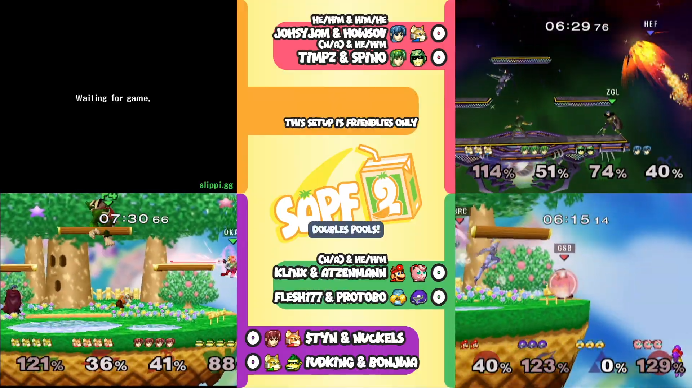
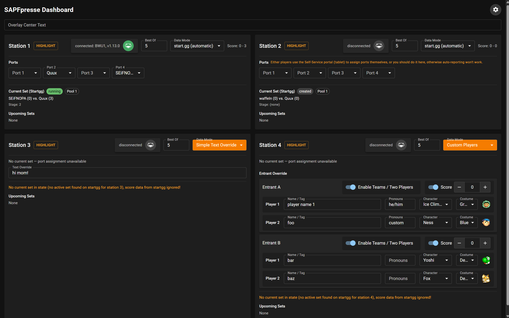

# Automeleec (previously named SAPF-presse)

Automeleec (AM) is an advanced, experimental stream system for in-person Super Smash Bros. Melee tournaments.

Uses data from start.gg, Slippi, and a self-service portal (tablet, phone) to configure and update the stream layout, record replays, and report all match results to start.gg **fully automatically and instantly**.

Currently designed for quad-streams (4 stations/setups streamed at once) but will support 1-8 setups at some point.

## Stream Overlay / Scoreboard (for SAPF 2)

<em>Overlay screenshot was taken during production - other screenshots during development.</em>

## Dashboard

## Self-Service Portal

## Features

### Automeleec automatically...

- ...updates stream overlay / scoreboard using data from a start.gg stream queue like round ("Winners Finals" etc.), player tags and pronouns
- ...updates picked characters and scores on the overlay automatically using Slippi networking
- ...reports characters, stages and scores to start.gg
- ...records Slippi replays in a naming convention that's compatible with [slp2mp4](https://github.com/davisdude/slp2mp4) to the computer running AM with zero manual input
- ...respects handwarmers and doesn't record them and doesn't report them to start.gg
- ...updates the self-service portal with the current set status, players, score, and upcoming sets for a given station
- ...saves the application state (like overrides and Wii IPs) to the computer and loads it on restart

### Edge-case resistant

A match/game of a set needs to be replayed but was already reported to start.gg? No worries! Simply remove the set's last game on start.gg and AM will update the overlay's score after a few seconds.

Need to replay a full set? Use the "Reset Set" feature on the self-service portal. You can also do this on start.gg and change the station if needed.

AM outsources data storage to start.gg as much as possible, so in many cases you can update data on start.gg and AM will do it's best to adopt and reflect it.

### Easy-as-pie port entry

The only data that AM needs that can't be automated or configured before the tournament is which player is plugged into which port.

AM helps "automate" this data entry by providing a self-service portal designed for touch devices that can be used by TOs in a portable manner or stationary by players to guide them through the easy setup process for their set and get the port data.

The self-service portal shows the current sets and asks players about handwarmers before starting a set and then asks for the port mapping (see screenshots above). This is almost always all the human data entry that's needed, but the portal also provides features to change the port mapping during sets or reset the set (e.g. if handwarmers were played after starting the set).

### No USB hotswapping needed

Because AM always knows which set is being played on any connected station and reads Slippi data from the network, it can record replays to the computer and report sets to start.gg including character and stage picks. Replays are automatically named in an [slp2mp4](https://github.com/davisdude/slp2mp4) compatible fashion for it's directory mode with clear folder names and mechanisms to avoid losing any replays for the unlikely case of there being a file or folder name collision.

Since AM is experimental, it's recommended to keep USBs inserted in the Wiis regardless and enable replays in Slippi Nintendont as a backup replay recording. If anything is wrong with AM's recorded replays, you'll have to sort through the replays from the USB, but at least you have the backup.

Of course you can also just continue to instruct players to use hotswapping and it's going to work without any issues with AM.

Keep in mind that AM (in auto mode) will report set results automatically which other reporting tools like [Replay Manager](https://github.com/jmlee337/replay-manager-for-slippi) might not expect. Using Replay Manager for stations that were monitored by AM in auto mode is untested as of writing.

### All of the flexibility

What if automation is not possible or desired, or you need to go off-script and do something that can't be expressed with a start.gg set?

- "Simple Text Override" mode: shows an editable text field in the dashboard that's shown in the overlay instead of the automatic data
- "Custom Players" mode: a classic Melee scoreboard mode where all structural data that's usually automatically populated can be entered by hand, like player names, scores, and characters

These additional modes are useful for exhibition matches, unsupported formats like crew battles, or when external systems like Slippi or start.gg are unavailable.

## How does it work?

AM heavily relies on start.gg and Slippi network for it's automation.

On start.gg, TOs can set up a stream queue which can be selected in AM in the settings with a dropdown menu after entering the tournament's "slug" (basically a short name), which is in the tournament's URL.

The stream queue can be filled with sets that are assigned to stations in advance of the tournament or during the tournament.

AM will frequently check the stream queue, filter the contained sets by their station, and update the scoreboard, dashboard and self-service portal accordingly.

When there's no set in the "current set" slot for a given station, AM will take the next upcoming set for this station and "adopt" it to be the new "current set", which updates all three frontends.

Since AM also reports and closes sets automatically using Slippi networking data on start.gg, those completed sets are removed from the stream queue, causing AM to automatically adopt the next set in the queue without any human interaction required.

## What's needed to use Automeleec?

- a **stable** internet connection. AM currently heavily relies on being able to communicate with start.gg frequently. Outages can cause wrong set score reports, the stream queue to not progress correctly, and therefore the layout and replay file names to be wrong.
- a start.gg account to generate an API key for Automeleec (see `.env.example`) with permissions to report set data for the tournament you want to stream
- as many networked Wii consoles with Slippi Nintendont as you want to use with Automeleec (Wifi **_might_** be fine if you control the Wifi network, since using Slippi Mirroring + Relay with Automeleec is broken anyway at the moment, but LAN adapters for Wii are always preferred for a stable connection)
- disable pause in Melee because Automeleec currently doesn't have "pause-ragequit" detection and won't update the score in such cases

## Is it production-ready?

Absolutely not. Automeleec has so far only been used once at SAPF 2 for the side/quad-stream. Automeleec is experimental software. See the [list of bugs](https://github.com/FunctionDJ/Automeleec/issues?q=state%3Aopen%20label%3Abug).

## How do I install and run it?

No guarantees. Things will break, see "Is it production-ready?".

1. Install [Bun](https://bun.sh/)
2. `git clone` this repository or download the ZIP
3. `bun install`
4. `bun start`

## What's next?

There are a ton of ideas for enhancements to Automeleec. See the [issues page](https://github.com/FunctionDJ/Automeleec/issues).

## Why isn't Automeleec open-source?

The use and modification of Automeleec for educational purposes is explicitly allowed in the [LICENSE](LICENSE) file.

For any use beyond this, I want to have control over Automeleec. That doesn't mean that I want to financially profit from Automeleec - quite the opposite.
If Automeleec becomes production-ready, I might change the project's license to a strong copy-left license like AGPL3.
But until then, if you want to use this software for anything beyond what's allowed by the current license, please reach out to me. (See "Get in touch" or even just open an issue)
If you're a tinkerer or a Smash community member or anything like that, I'll very likely give you permission to try, use and/or modify this software.

## Runtime compatibility

### Bun

- v1.3.12 (and probably all previous versions): slippi status will flicker, otherwise seems to work mostly fine https://github.com/FunctionDJ/Automeleec/issues/31
- recommended: v1.3.13 (unreleased as of writing) should have the status flicker bug fixed

### Node.js

- most likely compatible with Node v25.6.1 and newer (though not tested in production yet, also older but still modern versions will also likely work)
- you'll need to use `NODE_ENV=production npx tsx backend/main.ts` instead of `bun start`

## Get in touch

There's no Discord server for Automeleec (yet), but you can find my socials and my Discord contact on my website:

### https://function.dj
